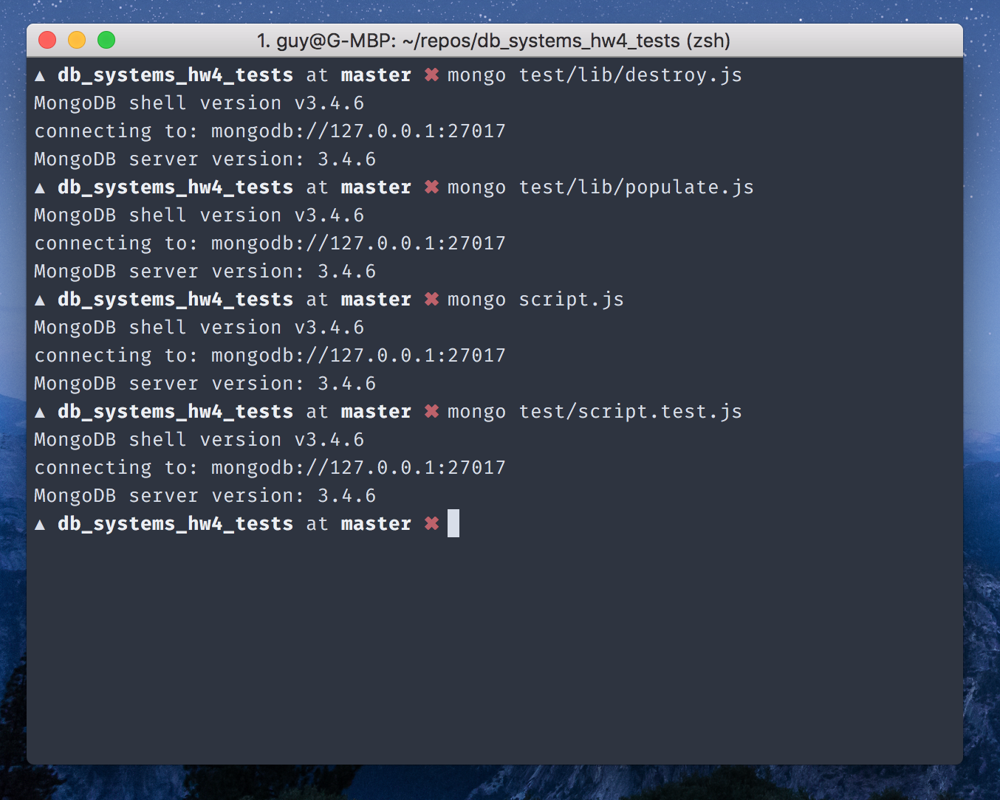
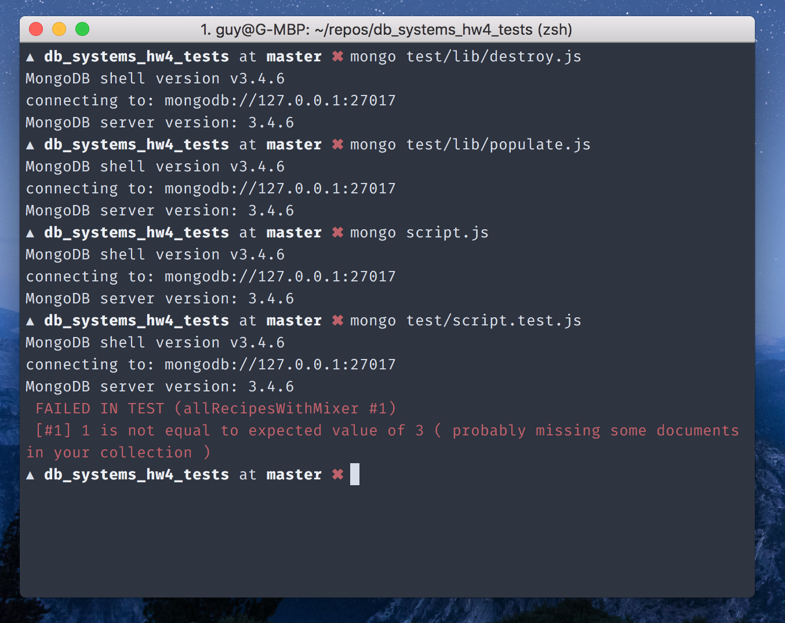

# HW4 Wet Tests 🚀

## Caveat

These tests might not be 100% accurate, may contain mistakes and may contain false positives/negatives.
Please use them at your discretion

## Requirements

* MongoDB shell version v3.4.6
* MongoDB server version: 3.4.6

## Usage

### With Node.js

> Make sure that you've moved `script.js` to the root directory, the NPM scripts rely on this.

```bash
$ npm run test
```

### Without Node.js

> Assuming your MongoDB server is running on localhost:27017.
> Otherwise, run instead of the first command, for example:
> ```bash
>   # replace <address:port> as needed
> $ mongo <address:port> test/lib/populate.js
> ```

```bash
  # populate the DB
$ mongo test/lib/populate.js
  # populate the DB
$ mongo script.js
  # run your script
$ mongo test/script.test.js
  # drop the collections
$ mongo test/lib/destroy.js
```

### If the above doesn't work

Try running from the mongo shell:

```javascript
#!/usr/local/bin/mongo
// populate the DB
load('test/lib/populate.js');
// run your script
load('script.js');
// run the test
load('test/script.test.js');
// drop the collections
load('test/lib/destroy.js');
```

In either case, you can always just run the `populate.js` script which (surprise, surprise) populates the DB, running your script and then comparing the `results1, results2, results3` collections to the expected one (see the [output](https://github.com/guywald1/db_systems_hw4_tests#output) part).

## Output

If you passed, there should be no special output.
Something like this:



If you failed, there should be indication as to which test you've failed (and sometimes a suggestion as to why you probably failed).



## Diffing

To see expected output, run:

```bash
$ mongo test/lib/showExpected.js
```
